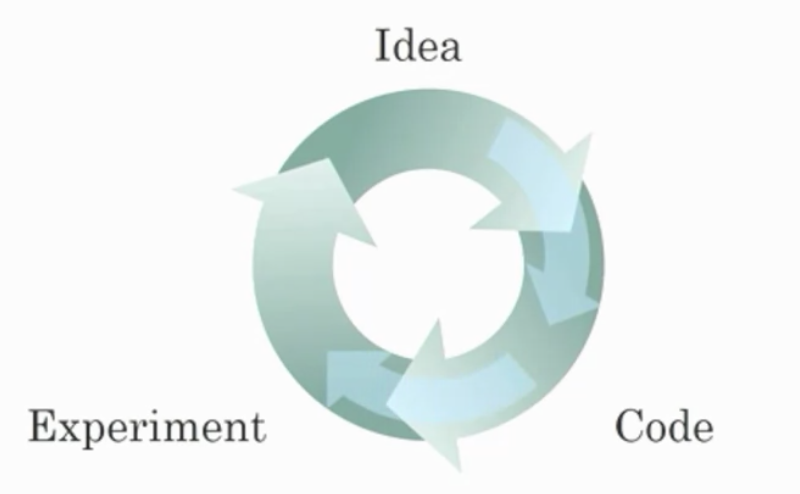
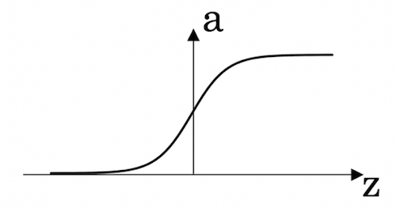
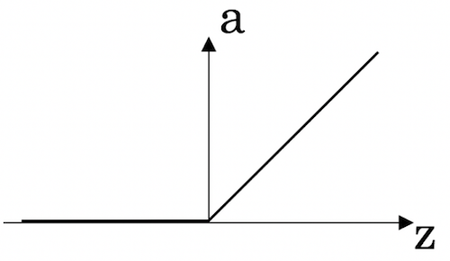
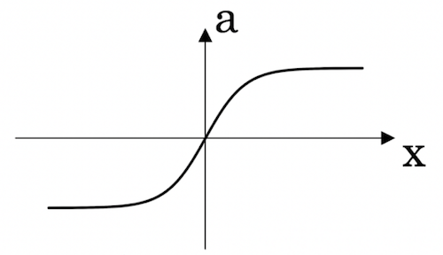
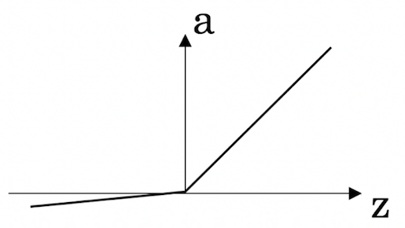
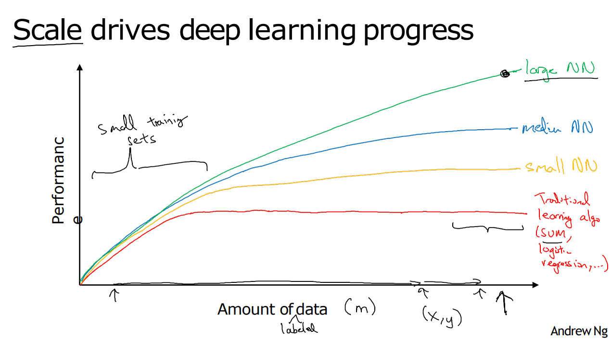

# Introduction to Deep Learning

## Graded Quiz

### Question 1

Which of the following are some aspects in which AI has transformed business?

- Web searching and advertisement.
- AI has not been able to transform businesses.
- Creating an AI-powered society.
- Eliminating the need for health care services.

Answer: A

Explanation: AI has helped to make a fit between services or results and consumers or queries.

### Question 2

Which of these are reasons for Deep Learning recently taking off?

- Deep Learning has resulted in significant improvements in important applications such as online advertising, speech recognition, and image recognition.
- We have access to a lot more computational power.
- We have access to a lot more data.
- Neural Networks are a brand new field.

Answer: ABC

Explanation:

- These were all examples discussed in lecture 3.
- The development of hardware, perhaps especially GPU computing, has significantly improved deep learning algorithms' performance.
- The digitalization of our society has played a huge role in this.

### Question 3

Recall this diagram of iterating over different ML ideas. Which of the statements below are true?

- Improvements in the GPU/CPU hardware enable the discovery of better Deep Learning algorithms.
- Better algorithms can speed up the iterative process by reducing the necessary computation time.
- Larger amounts of data allow researchers to try more ideas and then produce better algorithms in less time.
- Better algorithms allow engineers to get more data and then produce better Deep Learning models.

Answer: AB

Explanation:

- By speeding up the iterative process, better hardware allows researchers to discover better algorithms.
- Recall how the introduction of the ReLU activation function helped reduce the time needed to train a model.

### Question 4

Neural networks are good at figuring out functions relating an input $x$ to an output $y$ given enough examples. True/False?

- True
- False

Answer: A

Explanation: With neural networks, we don't need to "design" features by ourselves. The neural network figures out the necessary relations given enough data.

### Question 5

Which of the following depicts a Sigmoid activation function?

- 
- 
- 
- 

Answer: A

Explanation: This is the sigmoid activation function; this function was changed for the ReLU activation function helping with the training of NN.

### Question 6

Features of animals, such as weight, height, and color, are used for classification between cats, dogs, or others. This is an example of "structured" data, because they are represented as arrays in a computer. True/False?

- True
- False

Answer: A

Explanation: The data can be represented by columns of data. This is an example of structured data, unlike images of the animal.

### Question 7

A dataset is composed of age and weight data for several people. This dataset is an example of "structured" data because it is represented as an array in a computer. True/False?

- True
- False

Answer: A

Explanation: The sequences can be represented as arrays in a computer. This is an example of structured data.

### Question 8

Why is an RNN (Recurrent Neural Network) used for machine translation, say translating English to French?

- RNNs represent the recurrent process of Idea -> Code -> Experiment -> Idea -> ...
- It is strictly more powerful than a Convolutional Neural Network (CNN).
- It is applicable when the input/output is a sequence (e.g., a sequence of words).
- It can be trained as a supervised learning algorithm.

Answer: CD

Explanation:

- An RNN can map from a sequence of english words to a sequence of french words.
- We can train it on many pairs of sentences x (English) and y (French).

### Question 9

Suppose the information given in the diagram is accurate. We can deduce that when using large training sets, for a model to keep improving as the amount of data for training grows, the size of the neural network must grow. True/False?

- True
- False

Answer: A

Explanation: The graph shows that after a certain amount of data is fed to a NN it stops increasing its performance. To increase the performance it is necessary to use a larger model.

### Question 10

Assuming the trends described in the figure are accurate. The performance of a NN depends only on the size of the NN. True/False?

- True
- False

Answer: B

Explanation: According to the trends in the figure above, It also depends on the amount of data.
