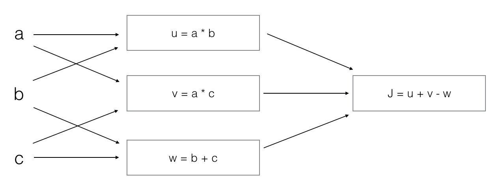

# Neural Networks Basics

## Graded Quiz

### Question 1

What does a neuron compute?

- A neuron computes a linear function $z=Wx+b$ followed by an activation function
- A neuron computes the mean of all features before applying the output to an activation function
- A neuron computes an activation function followed by a linear function $z=Wx+b$
- A neuron computes a function $g$ that scales the input $x$ linearly ($Wx+b$)

Answer: A

Explanation: We generally say that the output of a neuron is $a = g(Wx + b)$ where $g$ is the activation function (sigmoid, tanh, ReLU, ...).

### Question 2

Suppose that $\hat{y} = 0.5$ and $y=0$. What is the value of the "Logistic Loss"? Choose the best option.

- $+\infty$
- $0.5$
- $\mathcal{L}(\hat{y}, y) = -(y\log\hat{y} + (1-y)\log(1-\hat{y}))$
- $0.693$

Answer: D

Explanation: Given the values of $\hat{y}$ and $y$ we get $\mathcal{L}(0.5,0)=-(0 \log 0.5 + 1 \log 0.5) \approx 0.693$

### Question 3

Suppose img is a $(32,32,3)$ array, representing a $32 \times 32$ image with 3 color channels red, green and blue. How do you reshape this into a column vector $x$?

- `x = img.reshape((1, 32 * 32, 3))`
- `x = img.reshape((32 * 32 * 3, 1))`
- `x = img.reshape((32 * 32, 3))`
- `x = img.reshape((3, 32 * 32))`

Answer: B

### Question 4

Consider the following random arrays $a$, $b$, and $c$:

```python
a = np.random.randn(3, 4) # a.shape = (3, 4)
b = np.random.randn(1, 4) # b.shape = (1, 4)
c = a + b
```

What will be the shape of $c$?

- `c.shape = (1, 4)`
- `c.shape = (3, 4)`
- `c.shape = (3, 1)`
- The computation cannot happen because it is not possible to broadcast more than one dimension.

Answer: B

Explanation: Broadcasting is used, so row `b` is copied 3 times so it can be summed to each row of `a`.

### Question 5

Consider the two following random arrays $a$ and $b$:

```python
a = np.random.randn(4, 3) # a.shape = (4, 3)
b = np.random.randn(1, 3) # b.shape = (1, 3)
c = a * b
```

What will be the shape of $c$?

- The computation cannot happen because the sizes don't match.
- `c.shape = (4, 3)`
- `c.shape = (1, 3)`
- The computation cannot happen because it is not possible to broadcast more than one dimension.

Answer: B

Explanation: Broadcasting is invoked, so row `b` is multiplied element-wise with each row of `a` to create `c`.

### Question 6

Suppose you have $n_x$ input features per example. Recall that $X=[x^{(1)} x^{(2)} ... x^{(m)}]$. What is the dimension of $X$?

- $(m, 1)$
- $(n_x, m)$
- $(m, n_x)$
- $(1, m)$

Answer: B

### Question 7

Consider the following array:

```python
a = np.array([[2, 1], [1, 3]])
```

What is the result of `np.dot(a, a)`?

-

$$
\begin{pmatrix}
4 & 1 \\
1 & 9
\end{pmatrix}
$$

-

$$
\begin{pmatrix}
4 & 2 \\
2 & 6
\end{pmatrix}
$$

- The computation cannot happen because the sizes don't match. It's going to be an "Error"!

-

$$
\begin{pmatrix}
5 & 5 \\
5 & 10
\end{pmatrix}
$$

Answer: D

Explanation: Recall that * indicates the element wise multiplication and that `np.dot()` is the matrix multiplication. Thus

$$
\begin{pmatrix}
(2)(2)+(1)(1) & (2)(1)+(1)(3) \\
(1)(2)+(3)(1) & (1)(1)+(3)(3)
\end{pmatrix}
$$

### Question 8

Consider the following code snippet:

```python
a.shape = (3, 4)
b.shape = (4, 1)

for i in range(3):
    for j in range(4):
        c[i][j] = a[i][j] + b[j]
```

How do you vectorize this?

- `c = a + b`
- `c = a.T + b.T`
- `c = a.T + b`
- `c = a + b.T`

Answer: D

### Question 9

Consider the code snippet:

```python
a.shape = (3, 3)
b.shape = (3, 3)
c = a ** 2 + b.T ** 2
```

Which of the following gives an equivalent output for `c`?

-

```python
for i in range(3):
    for j in range(3):
        c[i][j] = a[i][j] ** 2 + b[j][i] ** 2
```

-

```python
for i in range(3):
    c[i] = a[i] ** 2 + b[i] ** 2
```

- The computation cannot happen because the sizes don't match. It's going to be an "Error"!

-

```python
for i in range(3):
    for j in range(3):
        c[i][j] = a[i][j] ** 2 + b[i][j] ** 2
```

Answer: A

Explanation: This code squares each entry of `a` and adds it to the transpose of `b` square.

### Question 10

Consider the following computation graph.



What is the output $J$?

- $J = (b - 1) \times (c + a)$
- $J = (a - 1) \times (b + c)$
- $J = a \times b + b \times c + a \times c$
- $J = (c - 1) \times (b + a)$

Answer: B

Explanation: $J = u + v - w = a \times b + a \times c - (b + c) = a \times (b + c) - (b + c) = (a - 1) \times (b + c)$
