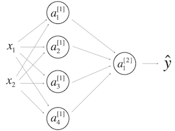

# Shallow Neural Networks

## Graded Quiz

### Question 1

Which of the following are true?

- $W_1$ is a matrix with rows equal to the parameter vectors of the first layer.
- $w^{[4]}_3$ is the row vector of parameters of the fourth layer and third neuron.
- $W^{[1]}$ is a matrix with rows equal to the transpose of the parameter vectors of the first layer.
- $W^{[1]}$ is a matrix with rows equal to the parameter vectors of the first layer.
- $w^{[4]}_3$ is the column vector of parameters of the fourth layer and third neuron.
- $w^{[4]}_3$ is the column vector of parameters of the third layer and fourth neuron.

Answer: CE

Explanation:

- We construct $W^{[1]}$ stacking the parameter vectors $w^{[1]T}_j$ of the first layer.
- The vector $w^{[i]}_j$ is the column vector of parameters of the i-th layer and j-th neuron of that layer.

```math
W^{[i]} =
\begin{pmatrix}
    \longleftarrow w^{[i]T}_1 \longrightarrow \\
    \longleftarrow w^{[i]T}_2 \longrightarrow \\
    \vdots \\
    \longleftarrow w^{[i]T}_{n^{[i]}} \longrightarrow
\end{pmatrix}
```

### Question 2

In which of the following cases is the linear (identity) activation function most likely used?

- When working with regression problems.
- As activation function in the hidden layers.
- For binary classification problems.
- The linear activation function is never used.

Answer: A

Explanation: In problems such as predicting the price of a house it makes sense to use the linear activation function as output.

### Question 3

Which of the following is a correct vectorized implementation of forward propagation for layer 2?

- $Z^{[2]} = W^{[2]}X + b^{[2]}$
  
  $A^{[2]} = g^{[2]}(Z^{[2]})$

- $Z^{[2]} = W^{[2]}A^{[1]} + b^{[2]}$
  
  $A^{[2]} = g(Z^{[2]})$

- $Z^{[1]} = W^{[1]}X + b^{[1]}$
  
  $A^{[1]} = g^{[1]}(Z^{[1]})$

- $Z^{[2]} = W^{[2]}A^{[1]} + b^{[2]}$
  
  $A^{[2]} = g^{[2]}(Z^{[2]})$

Answer: D

Explanation:  The elements of layer two are represented using a superscript in square brackets.

$Z^{[l]} = W^{[l]}A^{[l-1]} + b^{[l]}$

$A^{[l]} = g^{[l]}(Z^{[l]})$

### Question 4

The use of the ReLU activation function is becoming more rare because the ReLU function has no derivative for $c=0$. True/False?

- True
- False

Answer: B

Explanation: Although the ReLU function has no derivative at $c=0$ this rarely causes any problems in practice. Moreover it has become the default activation function in many cases, as explained in the lectures.

### Question 5

Consider the following code:

```python
x = np.random.rand(3, 2)
y = np.sum(x, axis=0, keepdims=True)
```

What will be `y.shape`?

- `(2,)`
- `(1, 2)`
- `(3,)`
- `(3, 1)`

Answer: B

Explanation: By choosing the `axis=0` the sum is computed over each column of the array, thus the resulting array is a row vector with 2 entries. Since the option `keepdims=True` is used the first dimension is kept, thus `(1, 2)`.

### Question 6

Suppose you have built a neural network. You decide to initialize the weights and biases to be zero. Which of the following statements is true?

- Each neuron in the first hidden layer will compute the same thing, but neurons in different layers will compute different things, thus we have accomplished "symmetry breaking" as described in the lecture.
- The first hidden layer's neurons will perform different computations from each other even in the first iteration; their parameters will thus keep evolving int their own way.
- Each neuron in the first hidden layer will perform the same computation in the first iteration. But after one iteration of gradient descent they will learn to compute different things because we have "broken symmetry".
- Each neuron in the first hidden layer will perform the same computation. So even after multiple iterations of gradient descent, each neuron in the layer will be computing the same thing as other neurons.

Answer: D

### Question 7

A single output and single layer neural network that uses the sigmoid function as activation is equivalent to the logistic regression. True/False?

- True
- False

Answer: A

Explanation: The logistic regression model can be expressed by $\hat{y} = \sigma(Wx+b)$. This is the same as $a^{[1]} = \sigma(W^{[1]}X+b)$.

### Question 8

Which of the following are true about the tanh function?

- The slope is zero for negative values.
- The derivative at $c=0$ is not well defined.
- For large values the slope is larger.
- The tanh is mathematically a shifted version of the sigmoid function.
- For large values the slope is close to zero.

Answer: DE

Explanation:

- You can see the shape of both is very similar but tanh passes through the origin.
- We can see in the graph of the $y=tanh(c)$ how as the values of $c$ increase the curve becomes flatter.

### Question 9

Consider the following 1 hidden layer neural network:



Which of the following statements are True?

- $W^{[1]}$ will have shape `(4, 2)`
- $W^{[1]}$ will have shape `(2, 4)`
- $b^{[1]}$ will have shape `(4, 1)`
- $b^{[1]}$ will have shape `(2, 1)`
- $W^{[2]}$ will have shape `(4, 1)`
- $W^{[2]}$ will have shape `(1, 4)`
- $b^{[2]}$ will have shape `(4, 1)`
- $b^{[2]}$ will have shape `(1, 1)`

Answer: ACFH

Explanation: For a layer $l$ with $n^{[l - 1]}$ inputs and $n^{[l]}$ outputs, $W^{[l]}$ is $(n^{[l]}, n^{[l - 1]})$ and $b^{[l]}$ is $(n^{[l]}, 1)$.

### Question 10

What are the dimensions of $Z^{[1]}$ and $A^{[1]}$?


- $Z^{[1]}$ and $A^{[1]}$ are `(4, m)`
- $Z^{[1]}$ and $A^{[1]}$ are `(4, 2)`
- $Z^{[1]}$ and $A^{[1]}$ are `(1, 4)`
- $Z^{[1]}$ and $A^{[1]}$ are `(4, 1)`

Answer: A

Explanation: For a layer $l$ with $n^{[l]}$ neurons and $m$ samples, $Z^{[l]}$ and $A^{[l]}$ are $(n^{[l]}, m)$.
