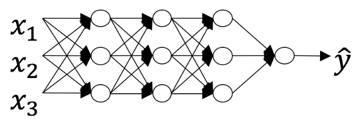
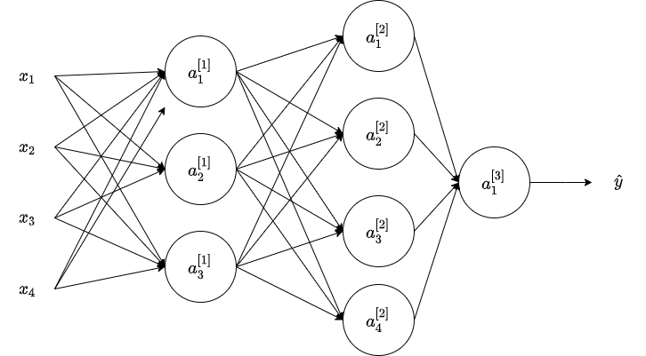

# Deep Neural Networks

## Graded Quiz

### Question 1

We use the "cache" in our implementation of forward and backward propagation to pass useful values to the next layer in the forward propagation. True/False?

- True
- False

Answer: B

Explanation: The "cache" is used in our implementation to store values computed during forward propagation to be used in backward propagation.

### Question 2

Which of the following are "parameters" of a neural network?

- $W^{[l]}$ the weight matrices.
- $L$ the number of layers of the neural network.
- $g^{[l]}$ the activation functions.
- $b^{[l]}$ the bias vector.

Answer: AD

Explanation: The weight matrices and the bias vectors are the parameters of the network.

### Question 3

Which of the following statements is true?

- The earlier layers of a neural network are typically computing more complex features of the input than the deeper layers.
- The deeper layers of a neural network are typically computing more complex features of the input than the earlier layers.

Answer: B

### Question 4

Vectorization allows you to compute forward propagation in an $L$-layer neural network without an explicit for-loop (or any other explicit iterative loop) over the layers `l=1, 2, ...,L`. True/False?

- True
- False

Answer: B

Explanation: Forward propagation propagates the input through the layers, although for shallow networks we may just write all the lines ($a^{[2]} = g^{[2]}(z^{[2]})$, $z^{[2]} = W^{[2]}a^{[1]}+b^{[2]}$, ...) in a deeper network, we cannot avoid a for loop iterating over the layers: ($a^{[l]} = g^{[l]}(z^{[l]})$, $z^{[l]} = W^{[l]}a^{[l - 1]}+b^{[l]}$, ...).

### Question 5

Suppose `W[i]` is the array with the weights of the i-th layer, `b[i]` is the vector of biases of the i-th layer, and `g` is the activation function used in all layers. Which of the following calculates the forward propagation for the neural network with $L$ layers.

-

```python
for i in range(1, L):
    Z[i] = W[i] * A[i - 1] + b[i]
    A[i] = g(Z[i])
```

-

```python
for i in range(L):
    Z[i] = W[i] * X + b[i]
    A[i] = g(Z[i])
```

-

```python
for i in range(1, L + 1):
    Z[i] = W[i] * A[i - 1] + b[i]
    A[i] = g(Z[i])
```

-

```python
for i in range(L):
    Z[i + 1] = W[i + 1] * A[i + 1] + b[i + 1]
    A[i + 1] = g(Z[i + 1])
```

Answer: C

Explanation: Remember that the range omits the last number thus the range from `1` to `L + 1` gives the `L` necessary values.

### Question 6

Consider the following neural network.



How many layers does this network have?

- The number of layers $L$ is 5. The number of hidden layers is 4.
- The number of layers $L$ is 3. The number of hidden layers is 3.
- The number of layers $L$ is 4. The number of hidden layers is 4.
- The number of layers $L$ is 4. The number of hidden layers is 3.

Answer: D

Explanation: As seen in lecture, the number of layers is counted as the number of hidden layers + 1. The input and output layers are not counted as hidden layers.

### Question 7

During forward propagation, to calculate $A^{[l]}$, you use the activation function $g^{[l]}$ with the values of $Z^{[l]}$.  

True/False: During backward propagation, you calculate $dA^{[l]}$ from $Z^{[l]}$.

- True
- False

Answer: B

Explanation: During backward propagation we are interested in computing $dW^{[l]}$ and $db^{[l]}$. For that we use $g'^{[l]}$, $dZ^{[l]}$, $Z^{[l]}$, and $W^{[l]}$.

### Question 8

There are certain functions with the following properties:

- To compute the function using a shallow network circuit, you will need a large network (where we measure size by the number of logic gates in the network), but
- To compute it using a deep network circuit, you need only an exponentially smaller network.

True/False?

- True
- False

Answer: A

### Question 9

Consider the following 2 hidden layers neural network:



Which of the following statements are true?

- $W^{[1]}$ will have shape `(3, 4)`
- $W^{[1]}$ will have shape `(4, 3)`
- $b^{[1]}$ will have shape `(4, 1)`
- $b^{[1]}$ will have shape `(3, 1)`
- $W^{[2]}$ will have shape `(4, 3)`
- $W^{[2]}$ will have shape `(3, 4)`
- $b^{[2]}$ will have shape `(3, 1)`
- $b^{[2]}$ will have shape `(4, 1)`

Answer: ADEH

Explanation: More generally, the shape of $W^{[l]}$ is $(n^{[l]}, n^{[l-1]})$ and shape of $b^{[l]}$ is $(n^{[l]}, 1)$.

### Question 10

Whereas the previous question used a specific network, in the general case what is the dimension of $W^{[l]}$, the weight matrix associated with layer $l$?

- $(n^{[l-1]}, n^{[l]})$
- $(n^{[l]}, n^{[l+1]})$
- $(n^{[l]}, n^{[l-1]})$
- $(n^{[l+1]}, n^{[l]})$

Answer: C
