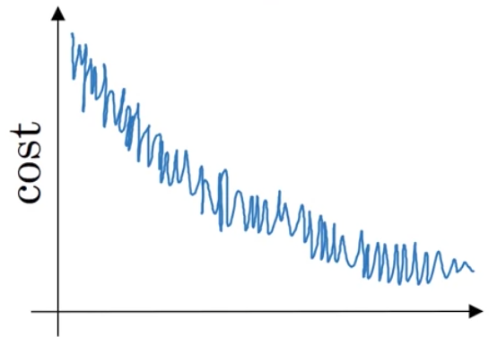
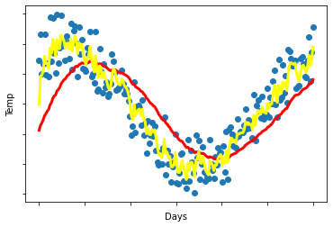
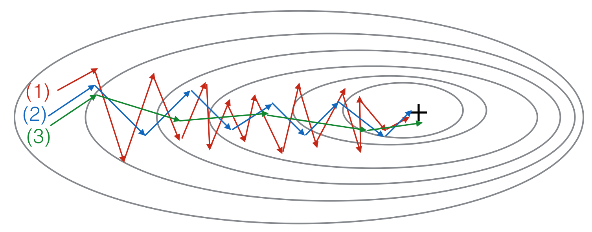

# Optimization Algorithms

## Graded Quiz

### Question 1

Using the notation for mini-batch gradient descent. To what of the following does $a^{[2]\lbrace 4\rbrace(3)}$ correspond?

- The activation of the second layer when the input is the third example of the fourth mini-batch.
- The activation of the fourth layer when the input is the second example of the third mini-batch.
- The activation of the second layer when the input is the fourth example of the third mini-batch.
- The activation of the third layer when the input is the fourth example of the second mini-batch.

Answer: A

Explanation: In general $a^{[l]\lbrace t\rbrace(k)}$ denotes the activation of the layer $l$ when the input is the example $k$ from the mini-batch $t$.

### Question 2

Which of these statements about mini-batch gradient descent do you agree with?

- Training one epoch (one pass through the training set) using mini-batch gradient descent is faster than training one epoch using batch gradient descent.
- One iteration of mini-batch gradient descent (computing on a single mini-batch) is faster than one iteration of batch gradient descent.
- You should implement mini-batch gradient descent without an explicit for-loop over different mini-batches, so that the algorithm processes all mini-batches at the same time (vectorization).

Answer: B

### Question 3

Which of the following is true about batch gradient descent?

- It has as many mini-batches as examples in the training set.
- It is the same as the mini-batch gradient descent when the mini-batch size is the same as the size of the training set.
- It is the same as stochastic gradient descent, but we don't use random elements.

Answer: B

Explanation: When using batch gradient descent there is only one mini-batch thus it is equivalent to mini-batch gradient descent with batch size same as the size of the training set.

### Question 4

While using mini-batch gradient descent with a batch size larger than $1$ but less than $m$, the plot of the cost function $J$ looks like this:

You notice that the value of $J$ is not always decreasing. Which of the following is the most likely reason for that?

- The algorithm is on a local minimum thus the noisy behaviour.
- You are not implementing the moving averages correctly. Using moving averages will smooth the graph.
- In mini-batch gradient descent we calculate $J(\hat{y}^{\lbrace t\rbrace}, y^{\lbrace t\rbrace})$ thus with each batch we compute over a new set of data.
- A bad implementation of the backpropagation process, we should use gradient check to debug our implementation.

Answer: C

Explanation: Since at each iteration we work with a different set of data or batch the loss function doesn't have to be decreasing at each iteration.

### Question 5

Suppose the temperature in Casablanca over the first two days of March are the following:

1. March 1st: $\theta_1 = 30^o C$
2. March 2nd: $\theta_2 = 15^o C$

Say you use an exponentially weighted average with $\beta=0.5$ to track the temperature: $v_0=0$, $v_t=\beta v_{t-1} + (1-\beta)\theta_t$. If $v_2$ is the value computed after day 2 without bias correction, and $v_2^{\text{corrected}}$ is the value you compute with bias correction. What are these values?

- $v_2=20$, $v_2^{\text{corrected}}=15$
- $v_2=15$, $v_2^{\text{corrected}}=20$
- $v_2=20$, $v_2^{\text{corrected}}=20$
- $v_2=15$, $v_2^{\text{corrected}}=15$

Answer: B

Explanation:

$v_1 = \beta v_0 + (1 - \beta)\theta_1 = 15$

$v_2 = \beta v_1 + (1 - \beta)\theta_2 = 15$

$v_2^{\text{corrected}} = \frac{v_2}{1 - \beta^2} = 20$

### Question 6

Which of the following is true about learning rate decay?

- The intuition behind it is that for later epochs our parameters are closer to a minimum thus it is more convenient to take smaller steps to prevent large oscillations.
- The intuition behind it is that for later epochs our parameters are closer to a minimum thus it is more convenient to take larger steps to accelerate the convergence.
- It helps to reduce the variance of a model.
- We use it to increase the size of the steps taken in each mini-batch iteration.

Answer: A

Explanation: Reducing the learning rate with time reduces the oscillation around a minimum.

### Question 7

You use an exponentially weighted average on the London temperature dataset. You use the following to track the temperature: $v_t = \beta v_{t-1} + (1-\beta)\theta_t$. The yellow and red lines were computed using values $\beta_1$ and $\beta_2$ respectively. Which of the following are true?

- $\beta_1 < \beta_2$
- $\beta_1 = 0$, $\beta_2 > 0$
- $\beta_1 > \beta_2$
- $\beta_1 = \beta_2$

Answer: A

Explanation: $\beta_1 < \beta_2$ since the yellow curve is noisier.

### Question 8

Consider this figure:

These plots were generated with gradient descent; with gradient descent with momentum ($\beta=0.5$); and gradient descent with momentum ($\beta=0.9$). Which curve corresponds to which algorithm?

- (1) is gradient descent with momentum (small $\beta$), (2) is gradient descent with momentum (small $\beta$), (3) is gradient descent
- (1) is gradient descent with momentum (small $\beta$), (2) is gradient descent, (3) is gradient descent with momentum (large $\beta$)
- (1) is gradient descent, (2) is gradient descent with momentum (large $\beta$), (3) is gradient descent with momentum (small $\beta$)
- (1) is gradient descent, (2) is gradient descent with momentum (small $\beta$), (3) is gradient descent with momentum (large $\beta$)

Answer: D

### Question 9

Suppose batch gradient descent in a deep network is taking excessively long to find a value of the parameters that achieves a small value for the cost function $\mathcal{J}(W^{[1]}, b^{[1]}, ..., W^{[L]}, b^{[L]})$. Which of the following techniques could help find parameter values that attain a small value for $\mathcal{J}$?

- Try better random initialization for the weights
- Try tuning the learning rate $\alpha$
- Try initializing all the weights to zero
- Try mini-batch gradient descent
- Try using Adam

Answer: ABDE

### Question 10

Which of the following are true about Adam?

- Adam combines the advantages of RMSProp and momentum.
- The most important hyperparameter on Adam is $\epsilon$ and should be carefully tuned.
- Adam can only be used with batch gradient descent and not with mini-batch gradient descent.
- Adam automatically tunes the hyperparameter $\alpha$.

Answer: A

Explanation: Precisely Adam combines the features of RMSProp and momentum that is why we use two-parameter $\beta_1$ and $\beta_2$, besides $\epsilon$.
