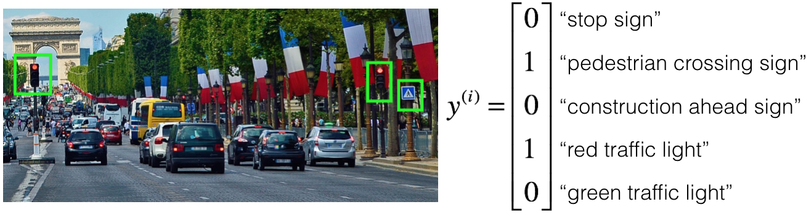
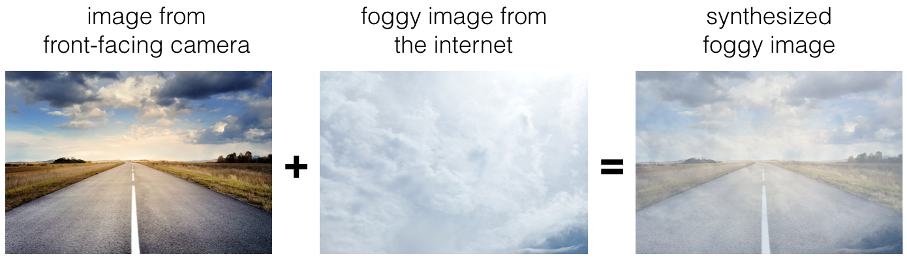

# Autonomous Driving

## Graded Quiz

### Problem Statement

To help you practice strategies for machine learning, this week we'll present another scenario and ask how you would act. We think this "simulator" of working in a machine learning project will give a task of what leading a machine learning project could be like!

You are employed by a startup building self-driving cars. You are in charge of detecting road signs (stop sign, pedestrian crossing sign, construction ahead sign) and traffic signals (red and green lights) in images. The goal is to recognize which of these objects appear in each image. As an example, the below image contains a pedestrian crossing sign and red traffic lights.

Your 100,000 labeled images are taken using the front-facing camera of your car. This is also the distribution of data you care most about doing well on. You think you might be able to get a much larger dataset off the internet, that could be helpful for training even if the distribution of internet data is not the same.

#### Question 1

You are just getting started on this project. What is the first thing you do? Assume each of the steps below would take about an equal amount of time (a few days).

- Spend a few days training a basic model and see what mistakes it makes.
- Spend a few days getting the internet data, so that you understand better what data is available.
- Spend a few days checking what is human-level performance for these tasks so that you can get an accurate estimate of Bayes error.
- Spend a few days collecting more data using the front-facing camera of your car, to better understand how much data per unit time you can collect.

Answer: A

Explanation: As discussed in lecture, applied ML is a highly iterative process. If you train a basic model and carry out error analysis (see what mistakes it makes) it will help point you in more promising directions.

#### Question 2

Your goal is to detect road signs (stop sign, pedestrian crossing sign, construction ahead sign) and traffic signals (red and green lights) in images. The goal is to recognize which of these objects appear in each image. You plan to use a deep neural network with ReLU units in the hidden layers.

Suppose that you use a sigmoid function for the output layer, and the output $\hat{y}$ has shape $(5, 1)$. Which of the following best describes the cost function?

- $\displaystyle\frac{1}{m} \displaystyle\sum_{i=1}^m \displaystyle\sum_{j=1}^5 \mathcal{L}(\hat{y}_j^{(i)}, y_j^{(i)})$
- $\displaystyle\frac{1}{m} \displaystyle\sum_{i=1}^m \left(-y^{(i)} \log \hat{y}^{(i)} - (1 - y^{(i)}) \log (1 - \hat{y}^{(i)})\right)$
- $\displaystyle\frac{1}{m} \displaystyle\sum_{i=1}^m \displaystyle\sum_{j=1}^5 \mathcal{L}(\hat{y}_i^{(j)}, y_i^{(j)})$
- $\displaystyle\frac{\exp \hat{y_j}^{(i)}}{\sum_{j=1}^5 \exp \hat{y_j}^{(i)}}$

Answer: A

Explanation: Here we compare each component of the prediction $\hat{y}$ with the respective component of the label $y$, and sum over the individual losses.

#### Question 3

You are working out error analysis and counting up what errors the algorithm makes. Which of the following do you think you should manually go through and carefully examine, one image at a time?

- 500 images of the dev set, on which the algorithm made a mistake.
- 500 images of the train set, on which the algorithm made a mistake.
- 500 images of the test set, on which the algorithm made a mistake.
- 500 images of the training-dev set, on which the algorithm made a mistake.

Answer: A

Explanation: We focus on images that the algorithm got wrong from the dev set. That is the one we use to make choices between different iterations of the system.

#### Question 4

After working on the data for several weeks, your team ends up with the following data:

- 100,000 labeled images taken using the front-facing camera of your car.
- 900,000 labeled images of roads downloaded from the internet.
- Each image's labels precisely indicate the presence of any specific road signs and traffic signals or combinations of them. For example, $y^{(i)} = [1, 0, 0, 1, 0]^T$ means the image contains a stop sign and a red traffic light.

Because this is a multi-task learning problem, you need to have all your $y^{(i)}$ vectors fully labeled. If one example is equal to $[0, ?, 1, 1, ?]^T$ then the learning algorithm will not be able to use that example. True/False?

- True
- False

Answer: B

Explanation: As seen in the lecture on multi-task learning, you can compute the cost such that it is not influenced by the fact that some entries haven’t been labeled.

#### Question 5

The distribution of data you care about contains images from your car's front-facing camera, which comes from a different distribution than the images you were able to find and download off the internet. Which of the following are true about the train/dev/test split?

- The dev and test sets must come from the front-facing camera.
- The dev and test sets must contain some images from the internet.
- The train, dev, and test must come from the same distribution.
- The dev and test sets must come from the same distribution.

Answer: AD

Explanation:

- This is the distribution we care about most, thus we should use this as a target.
- This is required to aim the target where we want to be.

#### Question 6

Assume you've finally chosen the following split between the data:

| Dataset      | Contains                                                                                                | Error |
| ------------ | ------------------------------------------------------------------------------------------------------- | ----- |
| Training     | 940,000 images randomly picked from (900,000 internet images + 60,000 car's front-facing camera images) | 12%   |
| Training-Dev | 20,000 images randomly picked from (900,000 internet images + 60,000 car's front-facing camera images)  | 15.1% |
| Dev          | 20,000 images from the car's front-facing camera                                                        | 12.6% |
| Test         | 20,000 images from the car's front-facing camera                                                        | 15.8% |

You also know that human-level error on the road sign and traffic signals classification task is around 0.5%. Which of the following is True?

- You have a high variance problem.
- You have a high bias.
- You have a large data-mismatch problem.
- You have a too low avoidable bias.

Answer: B

Explanation: The avoidable bias is significantly high since the training error is a lot higher than the human-level error.

#### Question 7

For the above provided data split, assume you've the following errors:

| Dataset      | Error |
| ------------ | ----- |
| Training     | 2%    |
| Training-Dev | 2.3%  |
| Dev          | 1.3%  |
| Test         | 1.1%  |

You also know that human-level error on the road sign and traffic signals classification task is around 0.5%. Based on the information given, a friend thinks that the training data distribution is much harder than the dev/test distribution. What do you think?

- Your friend is wrong. (i.e., Bayes error for the dev/test distribution is probably higher than for the train distribution.)
- Your friend is probably right. (i.e., Bayes error for the dev/test distribution is probably lower than for the train distribution.)
- There's insufficient information to tell if your friend is right or wrong.

Answer: B

Explanation: Since the training-dev error is higher than the dev and test errors, the dev/test distribution is probably "easier" than the training distribution.

#### Question 8

You decide to focus on the dev set and check by hand what the errors are due to. Here is a table summarizing your discoveries:

| Overall dev set error                     | 15.3% |
| :---------------------------------------- | :---- |
| Errors due to incorrectly labelled data   | 4.1%  |
| Errors due to foggy pictures              | 2.0%  |
| Errors due to partially occluded elements | 8.2%  |
| Errors due to other causes                | 1.0%  |

In this table, 4.1%, 8.2%, etc. are a fraction of the total dev set (not just examples of your algorithm mislabeled). For example, about 8.2/15.3 = 54% of your errors are due to partially occluded elements in the image.

Which of the following is the correct analysis to determine what to prioritize next?

- Since $8.2 > 4.1 + 2.0 + 1.0$, the priority should be to get more images with partially occluded elements.
- Since there is a high number of incorrectly labelled data in the dev set, you should prioritize fixing the labels on the whole training set.
- You should weigh how costly it would be to get more images with partially occluded elements, to decide if the team should work on it or not.
- You should prioritize getting more foggy pictures since that will be easier to solve.

Answer: C

Explanation: You should consider the trade-off between the data accessibility and potential improvement of your model trained on this additional data.

#### Question 9

You decide to focus on the dev set and check by hand what the errors are due to. Here is a table summarizing your discoveries:

| Overall dev set error                     | 15.3% |
| :---------------------------------------- | :---- |
| Errors due to incorrectly labelled data   | 4.1%  |
| Errors due to foggy pictures              | 3.0%  |
| Errors due to partially occluded elements | 7.2%  |
| Errors due to other causes                | 1.0%  |

In this table, 4.1%, 7.2%, etc. are a fraction of the total dev set (not just examples of your algorithm mislabeled). For example, about 7.2/15.3 = 47% of your errors are due to partially occluded elements.

You find out that there is an anti-reflective film guarantee to eliminate the sun reflection, but it is quite costly. Which of the following gives the best description of what the investment in the film can do to the model?

- The overall test set error will be reduced by at most 7.2%.
- The film will reduce the dev set error with 7.2% at the most.
- The film will reduce at least 7.2% of the dev set error.

Answer: B

Explanation: Remember that this 7.2% gives us an estimate for the ceiling of how much the error can be reduced when the cause is fixed.

#### Question 10

You decide to use data augmentation to address foggy images. You find 1,000 pictures of fog off the internet, and "add" them to clean images to synthesize foggy days, like this:

Which of the following statements do you agree with?

- So long as the synthesized fog looks realistic to the human eye, you can be confident that the synthesized data is accurately capturing the distribution of real foggy images (or a subset of it), since human vision is very accurate for the problem you're solving.
- Adding synthesized images that look like real foggy pictures taken from the front-facing camera of your car to the training dataset won't help the model improve because it will introduce avoidable bias.
- There is little risk of overfitting to the 1,000 pictures of fog so long as you are combining it with a much larger (>>1,000) set of clean/non-foggy images.

Answer: A

Explanation: If the synthesized images look realistic, then the model will just see them as if you had added useful data to identify road signs and traffic signals in foggy weather. It will very likely help.

#### Question 11

After working further on the problem, you've decided to correct the incorrectly labeled data. Your team corrects the labels of the wrongly predicted images on the dev set. Which of these statements do you agree with?

- You should also correct the incorrectly labelled data in the test set, so that the dev and test sets continue to come from the same distribution.
- You should correct the incorrectly labelled data in the training set as well so as to avoid your training set now being even more different from your dev set.
- You should not correct the incorrectly labelled data in the test set.
- You should not correct the incorrectly labelled data in the training set.

Answer: AD

Explanation:

- You want to make sure that your dev and test data come from the same distribution for your algorithm to make your team's iterative development process efficient.
- Deep learning algorithms are quite robust to having slightly different train and dev distributions.

#### Question 12

So far your algorithm only recognizes red and green traffic lights. One of your colleagues in the startup is starting to work on recognizing a yellow traffic light. (Some countries call it an orange light rather than a yellow light; we'll use the US convention of calling it yellow.)

Images containing yellow lights are quite rare, and she doesn't have enough data to build a good model. She hopes you can help her out. What do you tell your colleague?

- She should try using weights pre-trained on your dataset, and fine-tuning further with the yellow-light dataset.
- If she has (say) 10,000 images of yellow lights, randomly sample 10,000 images from your dataset and put your and her data together. This prevents your dataset from "swamping" the yellow lights dataset.
- You cannot help her because the distribution of data you have is different from hers, and is also lacking the yellow label.
- Recommend that she try multi-task learning instead of transfer learning using all the data.

Answer: A

Explanation: You have trained your model on a huge dataset, and she has a small dataset. Although your labels are different, the parameters of your model have been trained to recognize many characteristics of road and traffic images which will be useful for her problem. This is a perfect case for transfer learning, she can start with a model with the same architecture as yours, change what is after the last hidden layer and initialize it with your trained parameters.

#### Question 13

Another colleague wants to use microphones placed outside the car to better hear if there are other vehicles around you. For example, if there is a police vehicle behind you, you would be able to hear their siren. However, they don't have much to train this audio system. How can you help?

- Multi-task learning from your vision dataset could help your colleague get going faster. Transfer learning seems significantly less promising.
- Neither transfer learning nor multi-task learning seems promising.
- Either transfer learning or multi-task learning could help your colleague get going faster.
- Transfer learning from your vision dataset could help your colleague get going faster. Multi-task learning seems significantly less promising.

Answer: B

Explanation: The problem he is trying to solve is quite different from yours. The different dataset structures make it probably impossible to use transfer learning or multi-task learning.

#### Question 14

To recognize red and green lights, you have been using this approach:

- (A) Input an image (x) to a neural network and have it directly learn a mapping to make a prediction as to whether there's a red light and/or green light (y).

A teammate proposes a different, two-step approach:

- (B) In this two-step approach, you would first (i) detect the traffic light in the image (if any), then (ii) determine the color of the illuminated lamp in the traffic light.

Between these two, Approach B is more of an end-to-end approach because it has distinct steps for the input end and the output end. True/False?

- True
- False

Answer: B

Explanation: (A) is an end-to-end approach as it maps directly the input (x) to the output (y).

#### Question 15

An end-to-end approach doesn't require that we hand-design useful features, it only requires a large enough model. True/False?

- True
- False

Answer: A

Explanation: This is one of the major characteristics of deep learning models, that we don't need to hand-design the features.
