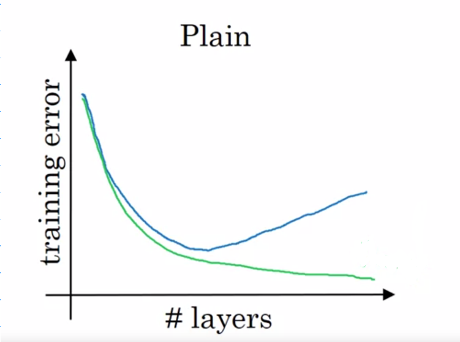

# Deep Convolutional Models

## Graded Quiz

### Question 1

Which of the following do you typically see in ConvNet?

- Multiple FC layers followed by a CONV layer.
- ConvNet makes exclusive use of CONV layers.
- Use of multiple POOL layers followed by a CONV layer.
- Use of FC layers after flattening the volume to generate output classes.

Answer: D

Explanation: FC layers are typically used in the last few layers after flattening the volume to generate the output in classification.

### Question 2

In LeNet-5 we can see that as we get into deeper networks the number of channels increases while the height and width of the volume decreases. True/False?

- True
- False

Answer: A

Explanation: Since in its implementation only valid convolutions were used, without padding, the height and width of the volume were reduced at each convolution. These were also reduced by the POOL layers, whereas the number of channels was increased from $6$ to $16$.

### Question 3

Based on the lectures, in the following picture, which curve corresponds to the expected behavior in theory, and which one corresponds to the behavior we get in practice? Consider this when using plain neural networks.

- The green one depicts the results in theory, and also in practice.
- The blue one depicts the results in theory, and also in practice.
- The green one depicts the results in theory, and the blue one the reality.
- The blue one depicts the theory, and the green one the reality.

Answer: C

Explanation: In theory, we expect that as we increase the number of layers the training error decreases; but in practice after a certain number of layers the error increases.

### Question 4

The following equation captures the computation in a ResNet block. What goes into the two blanks below, respectively?

$$a^{[l+2]} = g \left(W^{[l+2]}g(W^{[l+1]}a^{[l]}+b^{[l+1]})+b^{[l+2]}+\underline{\text{    }}\right)+\underline{\text{    }}$$

- $0$ and $a^{[l]}$
- $a^{[l]}$ and $0$
- $z^{[l]}$ and $a^{[l]}$
- $0$ and $z^{[l+1]}$

Answer: B

Explanation: Skip connection in residual block is given as $a^{[l+2]} = g(z^{[l+2]} + a^{[l]})$.

### Question 5

In the best scenario when adding a ResNet block it will learn to approximate the identity function after a lot of training, helping improve the overall performance of the network. True/False?

- True
- False

Answer: B

Explanation: When adding a ResNet block it can easily learn to approximate the identity function, thus in a worst-case scenario, it will not affect the performance of the network at all.

### Question 6

Suppose you have an input volume of dimension $n_H \times n_W \times n_C$. Which of the following statements do you agree with? (Assume that the "$1 \times 1$ convolutional layer" below always uses a stride of $1$ and no padding.)

- You can use a 2D pooling layer to reduce $n_H$, $n_W$, but not $n_C$.
- You can use a 2D pooling layer to reduce $n_H$, $n_W$, and $n_C$.
- You can use a $1 \times 1$ convolutional layer to reduce $n_C$ but not $n_H$ and $n_W$.
- You can use a $1 \times 1$ convolutional layer to reduce $n_H$, $n_W$, and $n_C$.

Answer: AC

Explanation: A $1 \times 1$ convolutional layer with a small number of filters is going to reduce $n_C$ but will keep the dimensions $n_H$ and $n_W$.

### Question 7

Which of the following are true about the Inception Network?

- Making an inception network deeper won't hurt the training set performance.
- One problem with simply stacking up several layers is the computational cost of it.
- Inception blocks allow the use of a combination of $1 \times 1$, $3 \times 3$, $5 \times 5$ convolutions and pooling by stacking up all the activations resulting from each type of layer.
- Inception blocks allow the use of a combination of $1 \times 1$, $3 \times 3$, $5 \times 5$ convolutions, and pooling by applying one layer after the other.

Answer: BC

Explanation:

- That is why the bottleneck layer is used to reduce the computational cost.
- The use of several different types of layers and stacking up the results to get a single volume is at the heart of the inception network.

### Question 8

Models trained for one computer vision task can't be used directly in another task. In most cases, we must change the softmax layer, or the last layers of the model and re-train for the new task. True/False?

- True
- False

Answer: A

Explanation: This is a good way to take advantage of open-source models trained more or less for the task you want to do. This may also help you save a great number of computational resources and data.

### Question 9

Which of the following are true about Depthwise-separable convolutions?

- The depthwise convolution convolves the input volume with $1 \times 1$ filters over the depth dimension.
- The pointwise convolution convolves the output volume with $1 \times 1$ filters.
- The depthwise convolution convolves each channel in the input volume with a separate filter.
- Depthwise-separable convolutions are composed of two different types of convolutions.

Answer: BCD

Explanation:

- The number of filters for the output of the depthwise-separable convolution is determined by the number of $1 \times 1$ filters used.
- The output of this kind of convolution is the same as the input.
- It is composed of a depthwise convolution followed by a pointwise convolution.

### Question 10

Suppose that in a MobileNet v2 Bottleneck block we have an $n \times n \times 5$ input volume, we use $30$ filters for the expansion, in the depthwise convolutions we use $3 \times 3$ filters, and $20$ filters for the projection. How many parameters are used in the complete block, suppose we don't use bias?

- $1020$
- $1101$
- $8250$
- $80$

Answer: A

Explanation:

- The expansion part will use $30$ filters of size $1 \times 1 \times 5$ each, having $5 \times 30 = 150$ parameters.
  
  This will output the volume of dimension $n \times n \times 30$.

- The depthwise convolution will use $30$ filters of size $3 \times 3$, having $3 \times 3 \times 30 = 270$ parameters.

  This will output the same volume of dimension $n \times n \times 30$.

- The projection part will use $20$ filters of size $1 \times 1 \times 30$ each, having $30 \times 20 = 600$ parameters.

  This will output the volume of dimension $n \times n \times 20$.

- Total trainable parameters will be $150 + 270 + 600 = 1020$.
