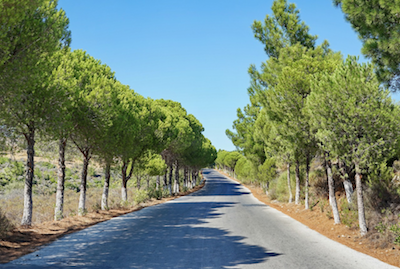
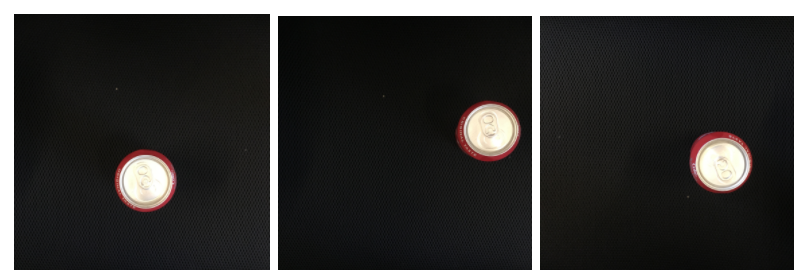
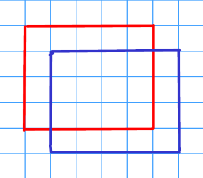
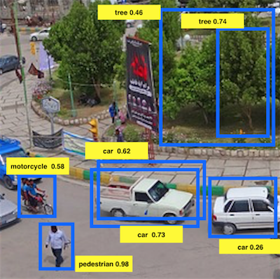
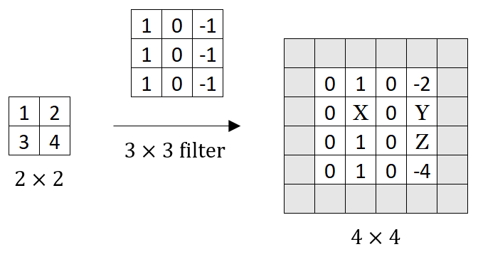
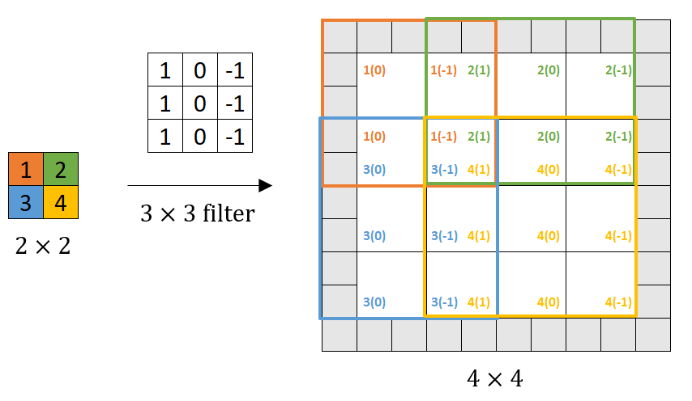

# Detection Algorithms

## Graded Quiz

### Question 1

You are building a 3-class object classification and localization algorithm. The classes are: pedestrian ($c=1$), car ($c=2$), motorcycle ($c=3$). What should $y$ be for the image below? Remember that "?" means "don't care", which means that the neural network loss function won't care what the neural network gives for that component of the output. Recall $y = [p_c, b_x, b_y, b_h, b_w, c_1, c_2, c_3]$.

- $y = [1, ?, ?, ?, ?, 0, 0, 0]$
- $y = [1, ?, ?, ?, ?, ?, ?, ?]$
- $y = [0, ?, ?, ?, ?, ?, ?, ?]$
- $y = [?, ?, ?, ?, ?, ?, ?, ?]$

Answer: C

Explanation: There is no object out of the 3 classes: pedestrian, car, and motorcycle. Hence $p_c=0$, and location and classification information are "?" or "don't care".

### Question 2

You are working on a factory automation task. Your system will see a can of soft-drink coming down a conveyor belt, and you want it to take a picture and decide whether (i) there is a soft-drink can in the image, and if so (ii) its bounding box. Since the soft-drink can is round, the bounding box is always square, and the soft drink can always appear the same size in the image. There is at most one soft drink can in each image. Here're some typical images in your training set:

To solve this task it is necessary to divide the task into two:

1. Construct a system to detect if a can is present or not.
2. Construct a system that calculates the bounding box of the can when present.

Which one of the following do you agree with the most?

- We can approach the task as an image classification with a localization problem.
- The two-step system is always a better option compared to an end-to-end solution.
- An end-to-end solution is always superior to a two-step system.
- We can't solve the task as an image classification with a localization problem since all the bounding boxes have the same dimensions.

Answer: A

Explanation: We can use a network to combine the two tasks similar to that described in the lectures.

### Question 3

If you build a neural network that inputs a picture of a person's face and outputs $N$ landmarks on the face (assume the input image always contains exactly one face), how many output units will the network have?

- $3N$
- $2N$
- $N^2$
- $N$

Answer: B

Explanation: For each landmark, we will have its x and y coordinates.

### Question 4

When training one of the object detection systems described in the lectures, each image must have zero or exactly one bounding box. True/False?

- True
- False

Answer: B

Explanation: In a single image, there might be more than only one instance of the object we are trying to localize, so it must have several bounding boxes.

### Question 5

What is the IoU between the red box and the blue box in the following figure? Assume that all the squares have the same measurements.

- $\displaystyle\frac{4}{5}$

- $\displaystyle\frac{2}{5}$

- $\displaystyle\frac{3}{7}$

- $\displaystyle\frac{1}{2}$

Answer: C

Explanation: IoU is calculated as the quotient of the area of the intersection (12) over the area of the union (28). $\text{IoU} = \frac{12}{28} = \frac{3}{7}$.

### Question 6

Suppose you run non-max suppression on the predicted boxes below. The parameters you use for non-max suppression are that boxes with probability $\le 0.4$ are discarded, and the IoU threshold for deciding if two boxes overlap is $0.5$. How many boxes will remain after non-max suppression?

- $7$
- $4$
- $3$
- $5$
- $6$

Answer: D

Explanation: $(\text{car}, 0.26)$ will be discarded. $(\text{car}, 0.73)$ and $(\text{car}, 0.62)$ have IoU greater than $0.5$, so $(\text{car}, 0.62)$ will be discarded. $(\text{tree}, 0.74)$ and $(\text{tree}, 0.46)$ have IoU less than $0.5$, so both of them will be kept.

### Question 7

If we use anchor boxes in YOLO we no longer need the coordinates of the bounding box $b_x$, $b_y$, $b_h$, $b_w$ since they are given by the cell position of the grid and the anchor box selection. True/False?

- True
- False

Answer: B

Explanation: We use the grid and anchor boxes to improve the capabilities of the algorithm to localize and detect objects, for example, two different objects that intersect, but we still use the bounding box coordinates.

### Question 8

Semantic segmentation can only be applied to classify pixels of images in a binary way as 1 or 0, according to whether they belong to a certain class or not. True/False?

- True
- False

Answer: B

Explanation: The same ideas used for multi-class classification can be applied to semantic segmentation.

### Question 9

Using the concept of Transpose Convolution, fill in the values of $X$, $Y$ and $Z$ below. Use $\text{padding} = 1$, $\text{stride} = 2$.

- $X= 2$, $Y=-6$, $Z= 4$
- $X= 2$, $Y= 6$, $Z= 4$
- $X= 2$, $Y=-6$, $Z=-4$
- $X=-2$, $Y=-6$, $Z=-4$

Answer: C

Explanation:

### Question 10

When using the U-Net architecture with an input $h \times w \times c$, where $c$ denotes the number of channels, the output will always have the shape $h \times w$. True/False?

- True
- False

Answer: B

Explanation: The output of the U-Net architecture can be $h \times w \times k$, where $k$ is the number of classes.
