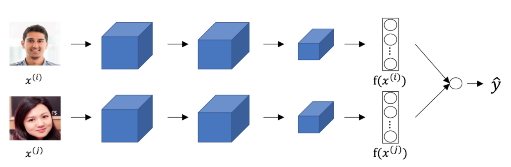

# Face Recognition & Neural Style Transfer

## Graded Quiz

### Question 1

Face verification requires comparing a new picture against one person's face, whereas face recognition requires comparing a new picture against $K$ persons' faces. True/False?

- True
- False

Answer: A

### Question 2

Why is the face verification problem considered a one-shot learning problem?

- Because we are trying to compare to one specific person only.
- Because we have to forward pass the image only one time through our neural network for verification.
- Because of the sensitive nature of the problem, we won't have a chance to correct it if the network makes a mistake.
- Because we might have only one example of the person we want to verify.

Answer: D

Explanation: One-shot learning refers to the amount of data we have to solve a task.

### Question 3

You want to build a system that receives a person's face picture and determines if the person is inside a workgroup. You have pictures of all the faces of the people currently in the workgroup, but some members might leave, and some new members might be added. To train a system to solve this problem using the triplet loss you must collect pictures of different faces from only the current members of the team. True/False?

- True
- False

Answer: B

Explanation: Although it is necessary to have several pictures of the same person, it is not absolutely necessary that all the pictures only come from current members of the team.

### Question 4

Triplet loss:

$\max \left(\Vert f(A) - f(P) \Vert^2 - \Vert f(A) - f(N) \Vert^2 + \alpha, 0\right)$

is larger in which of the following cases?

- When the encoding of $A$ is closer to the encoding of $N$ than to the encoding of $P$.
- When the encoding of $A$ is closer to the encoding of $P$ than to the encoding of $N$.
- When $A=P$ and $A=N$.

Answer: A

Explanation: In this case $\Vert f(A) - f(P) \Vert^2 > \Vert f(A) - f(N) \Vert^2$, thus the triplet loss gives a positive value larger than $\alpha$. The order of loss values in options will be $A > C > B$.

### Question 5

Consider the following Siamese network architecture:

The upper and lower networks share parameters to have a consistent encoding for both images. True/False?

- True
- False

Answer: A

Explanation: Part of the idea behind the Siamese network is to compare the encoding of the images, thus they must be consistent.

### Question 6

You train a ConvNet on a dataset with 100 different classes. You wonder if you can find a hidden unit which responds strongly to pictures of cats (i.e., a neuron so that, of all the input/training images that strongly activate that neuron, the majority are cat pictures.) You are more likely to find this unit in layer 4 of the network than in layer 1. True/False?

- True
- False

Answer: A

Explanation: The intuition about the layers of a neural network tells us that units that respond more to complex features are more likely to be in deeper layers.

### Question 7

Neural style transfer is trained as a supervised learning task in which the goal is to input two images $x$, and train a network to output a new, synthesized image $y$. True/False?

- True
- False

Answer: B

Explanation: Neural style transfer is about training the pixels of an image to make it look artistic, it is not learning any parameters.

### Question 8

In neural style transfer, we define style as:

- The correlation between the activation of the content image $C$ and the style image $S$.
- The correlation between activations across channels of an image.
- The correlation between the generated image $G$ and the style image $S$.
- $\Vert a^{[l] (S)} - a^{[l] (G)} \Vert^2$ the distance between the activation of the style image and the generated image.

Answer: B

Explanation: This correlation is represented by $G_{kk'}^{[l] (I)}$ for the image $I$.

### Question 9

In neural style transfer, which of the following better express the gradients used?

- $\displaystyle\frac{\partial J}{\partial S}$

- $\displaystyle\frac{\partial J}{\partial G}$

- $\displaystyle\frac{\partial J}{\partial W^{[l]}}$

- Neural style transfer doesn't use gradient descent since there are no trainable parameters.

Answer: B

Explanation: We use the gradient of the cost function over the value of the pixels of the generated image.

### Question 10

You are working with 3D data. The input "image" has size $32 \times 32 \times 32 \times 3$, if you apply a convolutional layer with $16$ filters of size $4 \times 4 \times 4$, valid padding and stride 1. What is the size of the output volume?

- $29 \times 29 \times 29 \times 13$
- $31 \times 31 \times 31 \times 16$
- $29 \times 29 \times 29 \times 16$
- $31 \times 31 \times 31 \times  3$

Answer: C

Explanation: We can use the formula $n^{[l]} = \Big\lfloor\frac{n^{[l-1]} + 2p - f}{s} + 1\Big\rfloor$ on the first three dimensions. Fourth dimension is the number of filters used in conv layer.
