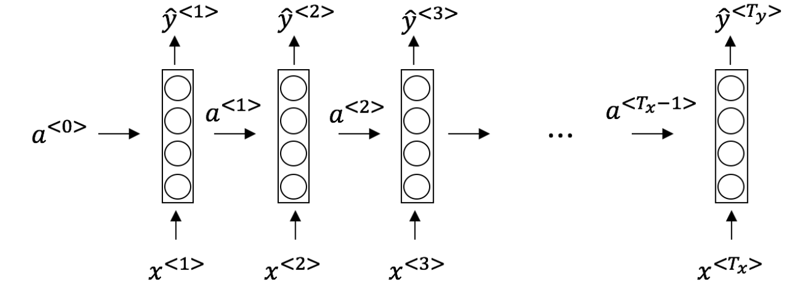
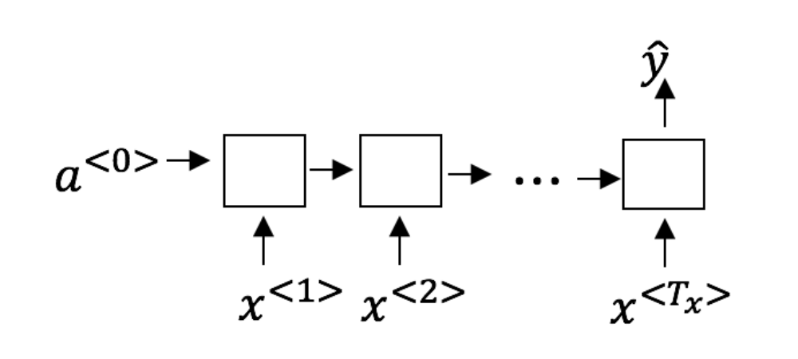
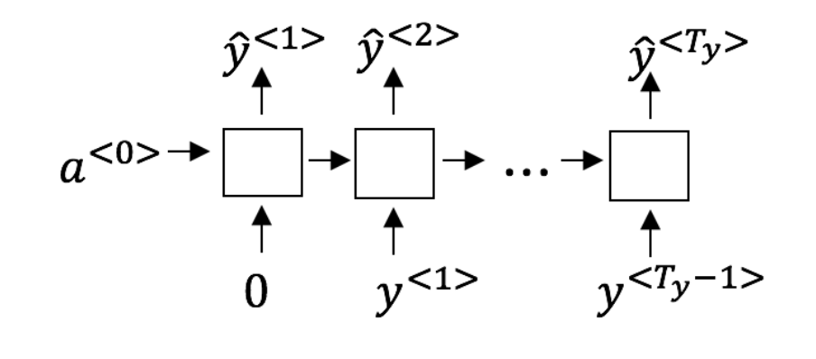
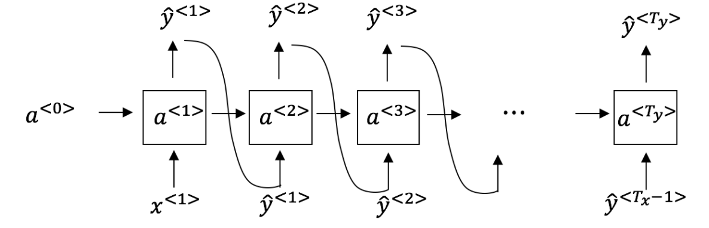

# Recurrent Neural Networks

## Graded Quiz

### Question 1

Suppose your training examples are sentences (sequences of words). Which of the following refers to the $j^{th}$ word in the $i^{th}$ training example?

- $x^{(i)< j >}$
- $x^{< i >(j)}$
- $x^{(j)< i >}$
- $x^{< j >(i)}$

Answer: A

Explanation: We index into the $i^{th}$ row first to get the $i^{th}$ training example (represented by parentheses), then the $j^{th}$ column to get the $j^{th}$ word (represented by the angle brackets).

### Question 2

Consider this RNN:

This specific type of architecture is appropriate when:

- $T_x = T_y$
- $T_x < T_y$
- $T_x > T_y$
- $T_x = 1$

Answer: A

Explanation: This type of architecture is for applications where the input and output sequence length is the same.

### Question 3

To which of these tasks would you apply a many-to-one RNN architecture?

- Image classification (input an image and output a label)
- Music genre recognition
- Language recognition from speech (input an audio clip and output a label indicating the language being spoken)
- Speech recognition (input an audio clip and output a transcript)

Answer: BC

### Question 4

Using this as the training model below, answer the following:

At the $t^{th}$ time step, what is the RNN doing?

- Estimating $P(y^{< 1 >}, y^{< 2 >}, \ldots, y^{< t - 1 >})$
- Estimating $P(y^{< t >})$
- Estimating $P(y^{< t >} \vert y^{< 1 >}, y^{< 2 >}, \ldots, y^{< t - 1 >})$
- Estimating $P(y^{< t >} \vert y^{< 1 >}, y^{< 2 >}, \ldots, y^{< t >})$

Answer: C

Explanation: In a training model we try to predict the next steps based on the knowledge of all prior steps.

### Question 5

You have finished training a language model RNN and are using it to sample random sentences, as follows:

What are you doing at each time step $t$?

- Use the probabilities output by the RNN to pick the highest probability word for that time-step as $\hat{y}^{< t >}$. Then pass the ground-truth word from the training set to the next time-step.
- Use the probabilities output by the RNN to randomly sample a chosen word for that time-step as $\hat{y}^{< t >}$. Then pass the ground-truth word from the training set to the next time-step.
- Use the probabilities output by the RNN to pick the highest probability word for that time-step as $\hat{y}^{< t >}$. Then pass this selected word to the next time-step.
- Use the probabilities output by the RNN to randomly sample a chosen word for that time-step as $\hat{y}^{< t >}$. Then pass this selected word to the next time-step.

Answer: D

Explanation: The probabilities output by the RNN are not used to pick the highest probability word and the ground-truth word from the training set is not the input to the next time-step.

### Question 6

You are training an RNN model, and find that your weights and activations are all taking on the value of `NaN` ("Not a Number"). Which of these is the most likely cause of this problem?

- Vanishing gradient problem.
- Exploding gradient problem.
- The model used the ReLU activation function to compute $g(z)$, where $z$ is too large.
- The model used the Sigmoid activation function to compute $g(z)$, where $z$ is too large.

Answer: B

### Question 7

Suppose you are training an LSTM. You have a 50000 word vocabulary, and are using an LSTM with 500-dimensional activations $a^{< t >}$. What is the dimension of $\Gamma_u$ at each time step?

- 500
- 5
- 50000
- 200

Answer: A

Explanation: $\Gamma_u$ is a vector of dimension equal to the number of hidden units in the LSTM.

### Question 8

Here are the update equations for the GRU.

$$
\begin{align*}
&\text{GRU} \\
\tilde{c}^{< t >} &= \tanh\left(W_c [\Gamma_r * c^{< t - 1 >}, x^{< t >}] + b_c\right) \\
\Gamma_u &= \sigma\left(W_u [c^{< t - 1 >}, x^{< t >}] + b_u\right) \\
\Gamma_r &= \sigma\left(W_r [c^{< t - 1 >}, x^{< t >}] + b_r\right) \\
c^{< t >} &= \Gamma_u * \tilde{c}^{< t >} + (1 - \Gamma_u) * c^{< t - 1 >} \\
a^{< t >} &= c^{< t >}
\end{align*}
$$

Alice proposes to simplify the GRU by always removing the $\Gamma_u$, i.e., setting $\Gamma_u=0$. Betty proposes to simplify the GRU by removing the $\Gamma_r$, i.e., setting $\Gamma_r=1$ always. Which of these models is more likely to work without vanishing gradient problems even when trained on very long input sequences?

- Alice's model (removing $\Gamma_u$), because if $\Gamma_r \approx 0$ for a time-step, the gradient can propagate back through that time-step without much decay.
- Alice's model (removing $\Gamma_u$), because if $\Gamma_r \approx 1$ for a time-step, the gradient can propagate back through that time-step without much decay.
- Betty's model (removing $\Gamma_r$), because if $\Gamma_u \approx 0$ for a time-step, the gradient can propagate back through that time-step without much decay.
- Betty's model (removing $\Gamma_r$), because if $\Gamma_u \approx 1$ for a time-step, the gradient can propagate back through that time-step without much decay.

Answer: C

Explanation: For the signal to backpropagate without vanishing, we need $c^{< t >}$ to be highly dependent on $c^{< t - 1 >}$.

### Question 9

Here are the equations for the GRU and the LSTM:

| GRU | LSTM |
| :-- | :--- |
| $\tilde{c}^{< t >} = \tanh\left(W_c [\Gamma_r * c^{< t - 1 >}, x^{< t >}] + b_c\right)$ | $\tilde{c}^{< t >} = \tanh\left(W_c [a^{< t - 1 >}, x^{< t >}] + b_c\right)$ |
| $\Gamma_u = \sigma\left(W_u [c^{< t - 1 >}, x^{< t >}] + b_u\right)$ | $\Gamma_u = \sigma\left(W_u [a^{< t - 1 >}, x^{< t >}] + b_u\right)$ |
| $\Gamma_r = \sigma\left(W_r [c^{< t - 1 >}, x^{< t >}] + b_r\right)$ | $\Gamma_f = \sigma\left(W_f [a^{< t - 1 >}, x^{< t >}] + b_f\right)$ |
|  | $\Gamma_o = \sigma\left(W_o [a^{< t - 1 >}, x^{< t >}] + b_o\right)$ |
| $c^{< t >} = \Gamma_u * \tilde{c}^{< t >} + (1 - \Gamma_u) * c^{< t - 1 >}$ | $c^{< t >} = \Gamma_u * \tilde{c}^{< t >} + \Gamma_f * c^{< t - 1 >}$ |
| $a^{< t >} = c^{< t >}$ | $a^{< t >} = \Gamma_o * \tanh c^{< t >}$ |

From these, we can see that the Update Gate and Forget Gate in the LSTM play a role similar to ____ and ____ in the GRU.

- $\Gamma_u$ and $1 - \Gamma_u$
- $\Gamma_u$ and $\Gamma_r$
- $1 - \Gamma_u$ and $\Gamma_u$
- $\Gamma_r$ and $\Gamma_u$

Answer: A

### Question 10

You have a pet dog whose mood is heavily dependent on the current and past few days' weather. You've collected data for the past 365 days on the weather, which you represent as a sequence as $x^{< t >}, \ldots, x^{< 365 >}$. You've also collected data on your dog's mood, which you represent as $y^{< 1 >}, \ldots, y^{< 365 >}$. You'd like to build a model to map from $x \rightarrow y$. Should you use a Unidirectional RNN or Bidirectional RNN for this problem?

- Bidirectional RNN, because this allows the prediction of mood on day $t$ to take into account more information.
- Bidirectional RNN, because this allows backpropagation to compute more accurate gradients.
- Unidirectional RNN, because the value of $y^{< t >}$ depends only on $x^{< 1 >}, \ldots, x^{< t >}$, but not on $x^{< t + 1 >}, \ldots, x^{< 365 >}$.
- Unidirectional RNN, because the value of $y^{< t >}$ depends only on $x^{< t >}$, and not other days' weather.

Answer: C
