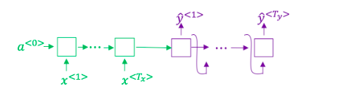
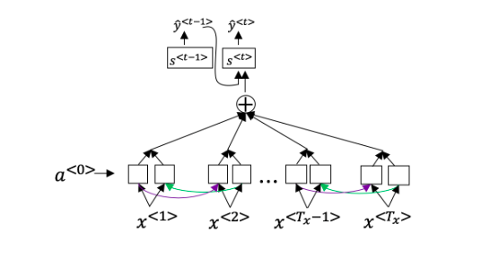

# Sequence Models and Attention Mechanism

## Graded Quiz

### Question 1

Consider using this encoder-decoder model for machine translation.

This model is a "conditional language model" in the sense that the encoder portion (shown in green) is modelling the probability of the input sentence $x$.

- True
- False

Answer: B

### Question 2

In beam search, if you decrease the beam width $B$, which of the following would you expect to be true?

- Beam search will converge after fewer steps.
- Beam search will use up more memory.
- Beam search will generally find better solutions i.e., do a better job maximizing $P(y \vert x)$.
- Beam search will run more quickly.

Answer: AD

Explanation: As the beam width decreases, beam search runs more quickly, uses up less memory, and converges after fewer steps, but will generally not find the maximum $P(y \vert x)$.

### Question 3

In machine translation, if we carry out beam search using sentence normalization, the algorithm will tend to output overly short translations.

- True
- False

Answer: B

Explanation: In machine translation, if we carry out beam search without using sentence normalization, the algorithm will tend to output overly short translations.

### Question 4

Suppose you are building a speech recognition system, which uses an RNN model to map from audio clip $x$ to a text transcript $y$. Your algorithm uses beam search to try to find the value of $y$ that maximizes $P(y \vert x)$.

On a dev set example, given an input audio clip, your algorithm outputs the transcript $\hat{y}=$ "I'm building an A Eye system in Silly con Valley.", whereas a human gives a much superior transcript $y^*=$ I'm building an AI system in Silicon Valley."

According to your model,

$$P(\hat{y} \vert x) = 7.21 \times 10^{-8}$$

$$P(y^* \vert x) = 1.09 \times 10^{-7}$$

Would you expect increasing the beam width $B$ to help correct this example?

- Yes, because $P(y^*\vert x) > P(\hat{y}\vert x)$ indicates the error should be attributed to the search algorithm rather than to the RNN.
- Yes, because $P(y^*\vert x) > P(\hat{y}\vert x)$ indicates the error should be attributed to the RNN rather than to the search algorithm.
- No, because $P(y^*\vert x) > P(\hat{y}\vert x)$ indicates the error should be attributed to the search algorithm rather than to the RNN.
- No, because $P(y^*\vert x) > P(\hat{y}\vert x)$ indicates the error should be attributed to the RNN rather than to the search algorithm.

Answer: A

Explanation: Increasing the beam width will generally allow beam search to find better solutions.

### Question 5

Continuing the example from Q4, suppose you work on your algorithm for a few more weeks, and now find that for the vast majority of examples on which your algorithm makes a mistake, $P(y^* \vert x) > P(\hat{y} \vert x)$. This suggests you should focus your attention on improving the search algorithm.

- True
- False

Answer: A

### Question 6

Consider the attention model for machine translation.

Further, here is the formula for $\alpha^{< t, t' >}$.

$$\alpha^{< t, t' >} = \frac{\exp(e^{< t,t' >})}{\sum_{t'=1}^{T_x} \exp(e^{< t,t' >})}$$

Which of the following statements about $\alpha^{< t,t' >}$ are true?

- We expect $\alpha^{< t,t' >}$ to be generally larger for values of $a^{< t' >}$ that are highly relevant to the value the network should output for $y^{< t' >}$.
- $\sum_{t'} \alpha^{< t,t' >} = 0$
- $\alpha^{< t,t' >}$ is equal to the amount of attention $y^{< t >}$ should pay to $a^{< t' >}$.
- $\sum_{t'} \alpha^{< t,t' >} = 1$

Answer: CD

Explanation:

- We expect $\alpha^{< t,t' >}$ to be larger for values of $a^{< t' >}$ that are highly relevant to the value the network should output for $y^{< t >}$.
- If we sum over $\alpha^{< t,t' >}$ for all $t'$ (the formulation can be seen in the image), the numerator will be equal to the denominator.

### Question 7

The network learns where to "pay attention" by learning the values $e^{< t,t' >}$, which are computed using a small neural network. Which of the following does $s^{< t >}$ depend on?

- $s^{< t+1 >}$
- $s^{< t >}$ is independent of $\alpha^{< t,t' >}$ and $e^{< t,t' >}$
- $e^{< t,t' >}$
- $\alpha^{< t,t' >}$

Answer: CD

Explanation: $s^{< t,t' >}$ depends on $\alpha^{< t,t' >}$ which in turn depends on $e^{< t,t' >}$.

### Question 8

Compared to the encoder-decoder model shown in Question 1 of this quiz (which does not use an attention mechanism), we expect the attention model to have the least advantage when:

- The input sequence length $T_x$ is small.
- The input sequence length $T_x$ is large.

Answer: A

Explanation: The encoder-decoder model works quite well with short sentences. The true advantage for the attention model occurs when the input sentence is large.

### Question 9

Under the CTC model, identical repeated characters not separated by the "blank" character (_) are collapsed. Under the CTC model, what does the following string collapse to?

__c_oo_o_kk___b_ooooo__oo__kkk

- coookkboooooookkk
- cookbook
- cook book
- cokbok

Answer: B

### Question 10

In trigger word detection, $x^{< t >}$ is:

- Whether someone has just finished saying the trigger word at time $t$.
- Features of the audio (such as spectogram features) at time $t$.
- Whether the trigger word is being said at time $t$.
- The $t$-th input word, represented as either a one-hot vector or a word embedding.

Answer: B
